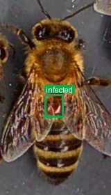
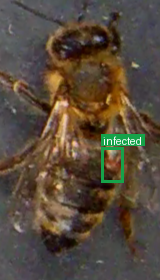
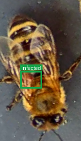
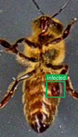

# BeeSafe Data Summary

The annotations are split into three subsets: **train**, **validation**, and **test** (`train/gt_one.csv`: 8225 samples; `val/gt_one.csv`: 1876; `test/gt_one.csv`: 3408). The full list of all samples is in `gt.csv` (13509 samples).

## Per-File Breakdown

| File | Samples | Labels |
|---|---:|---|
| `gt.csv` | 13509 | healthy: 9562 infected: 3947 |
| `test/gt_one.csv` | 3408 | healthy: 2466 infected: 942 |
| `train/gt_one.csv` | 8225 | healthy: 5671 infected: 2554 |
| `val/gt_one.csv` | 1876 | healthy: 1425 infected: 451 |

## Label distribution (overall)

| Class | Count | Ratio |
|---|---:|---:|
| healthy | 9562 | 70.78% |
| infected | 3947 | 29.22% |

## Label meanings

- **healthy**: healthy (VarroaDataset class 0)
- **infected**: Varroa-infected (legacy classes 1 and 3 combined)

## Sample images (3 per infected label; legacy 1 and 3)

### Infected

*`test/videos/2017-10-17_1-39-36/2017-10-17_1-39-36.mp4-bee_id_5908-65985-1.png` - **infected** (legacy class 1) - 1 box(es)*

*`train/videos/2017-09-20_19-24-55/2017-09-20_19-24-55.mp4-bee_id_3097-8040-1.png` - **infected** (legacy class 1) - 2 box(es)*

*`test/videos/2017-09-01_10-54-26/2017-09-01_10-54-26.mp4-bee_id_7904-24525-1.png` - **infected** (legacy class 1) - 1 box(es)*

*`train/videos/2017-08-28_09-30-00-1_500_dirty_glass/2017-08-28_09-30-00-1_500_dirty_glass.mp4-bee_id_7133-32115-1.png` - **infected** (legacy class 3) - 1 box(es)*

*`train/videos/2017-09-25_16-03-38-2/2017-09-25_16-03-38.mp4-bee_id_438-14745-1.png` - **infected** (legacy class 3) - 1 box(es)*

*`val/videos/2017-09-29_15-31-49/2017-09-29_15-31-49.mp4-bee_id_48-1245-1.png` - **infected** (legacy class 3) - 1 box(es)*
