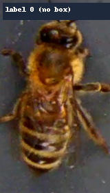

# BeeSafe Data Summary

- Data directory: `data`
- Files: **4**
- Samples: **27018**
- BBox samples: **7894** (29.22%)
- Malformed lines: **0**
- Missing image paths: **0**

## Label Distribution (Overall)

| Label | Count | Ratio |
|---:|---:|---:|
| 0 | 19124 | 70.78% |
| 1 | 6166 | 22.82% |
| 3 | 1728 | 6.40% |

## Per-File Breakdown

| File | Samples | BBox Samples | BBox Ratio | Malformed | Missing Images | Labels |
|---|---:|---:|---:|---:|---:|---|
| `gt.csv` | 13509 | 3947 | 29.22% | 0 | 0 | 0:9562 1:3083 3:864 |
| `test/gt_one.csv` | 3408 | 942 | 27.64% | 0 | 0 | 0:2466 1:736 3:206 |
| `train/gt_one.csv` | 8225 | 2554 | 31.05% | 0 | 0 | 0:5671 1:1974 3:580 |
| `val/gt_one.csv` | 1876 | 451 | 24.04% | 0 | 0 | 0:1425 1:373 3:78 |

## Sample images (boxes + labels)

*Note: requested **8** sample(s); **2** could be rendered (fewer image files exist locally than annotations reference).*

### Sample 1

*`gt.csv` — class **0** — negative (no box)*

### Sample 2

*`gt.csv` — class **0** — negative (no box)*
